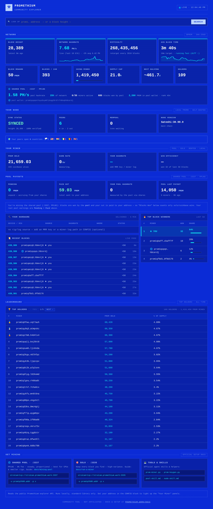

# ⚒ Promethium Community Dashboard

An easy, local **explorer + mining dashboard** for the [Promethium](https://promethium.work) (`$PROM`) network.
Live network stats with trend graphs, your balance & earnings, your hardware, a
recent-blocks feed, the top block winners, and an all-time holders leaderboard —
for **anyone** mining in the shared pool, solo, on rented rigs, or on a home CPU/GPU.

Reads the public Promethium explorer API. **No account, no packages — Python
standard library only.** One file: `explorer.py`.



---

## Install & run

### 🤖 With an agent (the "agentic mining" way)

This repo ships as an **agent skill** — hand it to Claude Code or Codex and let it
set everything up:

- **Claude Code:** drop `SKILL.md` into your skills folder (or open this repo and say
  *"set up the Promethium dashboard"*). It reads `SKILL.md`, asks for your `prom1…`
  address, launches the dashboard, and stays on as a mining co-pilot.
- **Codex / other agents:** open the repo — `AGENTS.md` gives the agent the same
  instructions.

### 🛠 Manual (60 seconds)

```bash
git clone https://github.com/devpyle/promethium-dashboard
cd promethium-dashboard
# edit the CONFIG block at the top of explorer.py -> set PROM_ADDRESS
python3 explorer.py
# open http://localhost:8899
```

No `prom1…` address yet? Make one with the official keygen:
```bash
curl -O https://promethium.work/downloads/prom-keygen.py && python3 prom-keygen.py   # back up the key!
```

---

## Configure

**Recommended:** copy `dashboard.conf.example` to `dashboard.conf` and put your
settings there — they override the defaults in `explorer.py`, live *outside* the
code, and survive every update (a `git pull` or re-download never touches them).

```bash
cp dashboard.conf.example dashboard.conf   # then edit dashboard.conf
python3 explorer.py
```

You can also just edit the CONFIG block at the top of `explorer.py` directly if you
prefer — but then remember your settings live in the file. Either way, the same
settings are available (env vars of the same name win over everything):

| Setting | Required? | What it does |
|---|---|---|
| `PROM_ADDRESS` | ✅ | Your `prom1…` payout address — powers the "Your Miner" panels |
| `PROM_ADDRESSES` | optional | Extra addresses to aggregate into your totals |
| `MRR_KEY` / `MRR_SECRET` | optional | MiningRigRentals API key → shows **rented-rig** hashrate (view-only; no withdraw needed) |
| `NICEHASH_ORG` / `NICEHASH_KEY` / `NICEHASH_SECRET` | optional | NiceHash API keys → shows **NiceHash-rented** hashpower (your active SHA-256 orders) |
| `MINER_LOG` | optional | Path to a local cpuminer/ccminer log → **home CPU/GPU** hashrate |
| `NODE_RPC` + `NODE_COOKIE` (or `NODE_RPC_USER`/`NODE_RPC_PASS`) | optional | Point at **your own** local `promd` RPC → lights up the **Your Node** panel (sync status, peer count, mempool, version) |
| `NODE_GEO` | optional | Roll your peers up into a **country count** (`🇺🇸4 🇩🇪2 …`). Uses ip-api.com; **no IP is ever shown or stored**. Set `False` to skip the geo call entirely |
| `HOST` | optional | `127.0.0.1` (local only) or `0.0.0.0` (reach it from other devices on your LAN) |

Without any address it still works as a pure network explorer.

---

## What it shows

- **Network** — height, hashrate (live trend graph), difficulty, block time (vs the 10-min target, with a trend graph), reward, blocks/24h, coins mined, next halving, holders, and the shared pool's wallet balance
- **Your Node** *(optional — if you run a node)* — sync status, peer count (in/out), mempool, node version, and a country rollup of your peers. Reads **your own** local `promd`; only counts are shown — **never any peer IP**
- **Your Miner** — balance, earn rate, hashrate, % of network, blocks won, win efficiency
- **Your Hardware** — rented rigs (MRR / NiceHash) and/or home CPU/GPU
- **Pool Payouts** — shared-pool miners auto-see their pending + paid PROM and pool-measured hashrate
- **Recent Blocks** — live feed of who won each block
- **Top Block Winners** — who's won the most blocks in the recent window
- **Top Holders** — the richest addresses all-time (the shared pool is flagged 🌐)
- **🔎 Look-up** — search any `prom1…` address or block height

---

## How hashrate detection works

The dashboard reads from two kinds of source, so it's clear what needs setup:

**From your `prom1…` address — automatic, no setup:** these come straight off the
public Promethium explorer API.
- PROM held / balance
- blocks won and your block-share
- earn rate

**From a mining source you connect — optional:** your **hashrate and hardware
can't be derived from an address** (the chain doesn't know what rigs you run), so
the dashboard reads them **live from whatever you point it at** — you never type
hashrate numbers in by hand:
- `MRR_KEY` / `MRR_SECRET` → your **MiningRigRentals** rented rigs + delivered hashrate
- `NICEHASH_ORG` / `NICEHASH_KEY` / `NICEHASH_SECRET` → your active **NiceHash** SHA-256 hashpower orders
- `MINER_LOG` → a local **cpuminer/ccminer** log for home CPU/GPU speed

Skip all of them and the dashboard still works as an address-based explorer — the
**Your Hardware** and **Your Hashrate** panels just stay empty.

---

## Start mining

The dashboard's **Get Mining** panel links straight to the official guides:

- **Shared pool** (`stratum.promethium.work:3337`, PPLNS, 0% fee) → [docs/mining-pool](https://promethium.work/docs/mining-pool) · [pool-skill.md](https://promethium.work/downloads/pool-skill.md)
- **Solo** (`:3335`, keep your own blocks) → [docs/run-a-miner](https://promethium.work/docs/run-a-miner)
- **Run a node** → [docs/run-a-node](https://promethium.work/docs/run-a-node) · [node-skill.md](https://promethium.work/downloads/node-skill.md)
- **Agentic mining** → [docs/agentic-mining](https://promethium.work/docs/agentic-mining)

---

## Updating

New features land often. Because your settings live in `dashboard.conf` (not in the
code), updating is a one-liner:

```bash
# cloned with git:
cd promethium-dashboard && git pull

# grabbed the single file:
curl -O https://raw.githubusercontent.com/devpyle/promethium-dashboard/main/explorer.py

# using an agent (Claude Code / Codex):
#   just say "update the Promethium dashboard"
```

Then restart `python3 explorer.py`. Your `dashboard.conf` is untouched — no
re-entering addresses or keys. (If you instead edited the CONFIG block inside
`explorer.py` directly, a `git pull` may conflict on those lines — moving your
settings into `dashboard.conf` once fixes that for good.)

## Notes

- Community tool — **not affiliated** with the Promethium project.
- Reads public API data only; never asks for private keys.
- MIT licensed — see [LICENSE](LICENSE).
